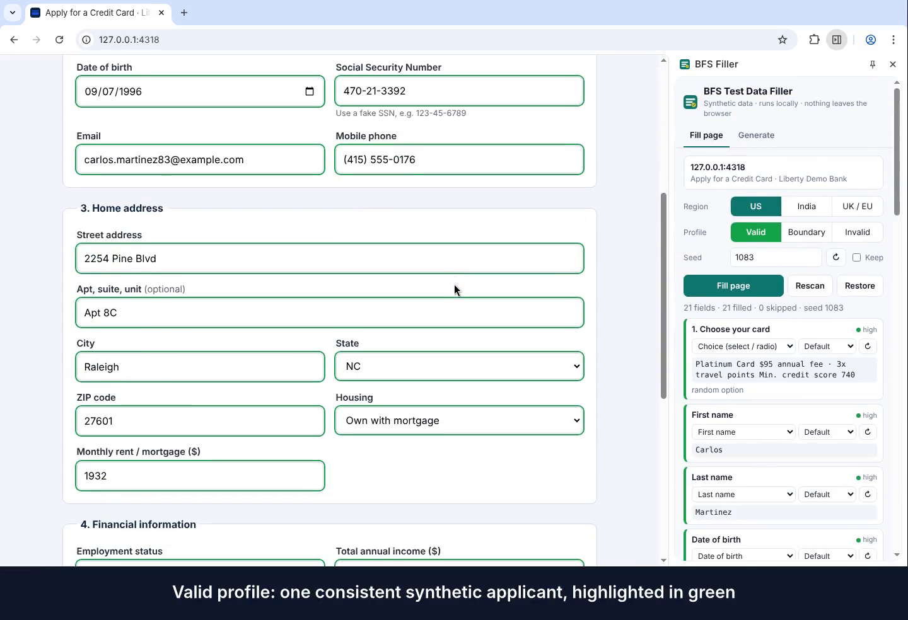

# RegOps Agent

Automated workflow for banking regulatory compliance testing. It pulls the
latest regulatory updates, generates labeled synthetic data, designs and runs
test cases, enriches them with SME knowledge, scores risks, ships a base
pytest automation suite, and renders an executive dashboard.

**Initial scope:** US · Retail banking · AML/CFT · conservative risk appetite.

> ⚠️ **All data in this repo is synthetic.** No real customer PII. Regulatory
> items in the current cycle are **proposed rules / advisories**, not final law;
> test cases tagged `human_review` need SME/legal sign-off before any
> regulatory use. Nothing here is legal advice.

---

## The 8-phase pipeline

| Phase | Module | Output |
|---|---|---|
| 1 · Regulatory intelligence | `core/phase1_regulatory.py` | `regulatory_register.json` |
| 2 · Synthetic data | `core/phase2_synthetic_data.py` | `data/*.csv` `*.json` `*.sql` |
| 3 · Test case design | `core/phase3_test_cases.py` | `test_cases.json` |
| 4 · Pass-through & validation | `core/phase4_validation.py` | `traceability_matrix.csv`, `validation_report.json` |
| 5 · SME enrichment | `core/phase5_sme.py` | `sme_enrichment.json` |
| 6 · Risk identification | `core/phase6_risk.py` | `risk_register.csv` / `.json` |
| 7 · Automation scripts | `tests/`, `core/risk_assertions.py` | pytest suite |
| 8 · Executive dashboard | `core/phase8_dashboard.py` | `executive_dashboard.html` |

## Quick start

```bash
pip install -r requirements.txt
pip install -e .

# run the whole pipeline (phases 1-8)
python -m regops.pipeline

# or a subset
python -m regops.pipeline --phases 1,2,3

# run the automated test suite
pytest -v
pytest -m smoke            # critical path only
pytest -m "aml and not human_review"
```

All artifacts land in `output/`. Open `output/executive_dashboard.html` in a
browser to see the summary.

## Architecture

```
regops/
  core/
    config.py                 thresholds, paths, reference lists, risk matrix
    phase1_regulatory.py      register + live-fetch interface (see docs/CONNECTORS.md)
    phase2_synthetic_data.py  labeled synthetic generator (customers/txns/loans)
    phase3_test_cases.py      test-case definitions + reference control logic
    phase4_validation.py      runs data through controls -> traceability + coverage
    phase5_sme.py             practitioner heuristics (tagged)
    phase6_risk.py            scored risk register
    phase8_dashboard.py       self-contained HTML dashboard
    risk_assertions.py        custom pytest assertion helpers
  pipeline.py                 orchestrator
tests/
  conftest.py                 fixtures + markers
  test_aml_retail.py          10 test cases across 4 suites
```

## How the pieces connect

The synthetic data (phase 2) carries an `expected_flag` on every record. The
reference control logic (phase 3) is what a bank's system *should* do; phase 4
runs every record through it and asserts the disposition matches the label.
That same control logic is what the pytest suite (phase 7) exercises, so the
tests, the validation report, and the dashboard all agree by construction.

To test a real system, replace the `screen_customer` / `evaluate_transaction` /
`evaluate_loan` functions in `phase3_test_cases.py` with calls to your API.

## Extending scope

- **More jurisdictions:** add EU/UK sources in `docs/CONNECTORS.md` and set
  `RUN_CONFIG["JURISDICTION"]`.
- **More domains:** add generators in `phase2` and matching control logic +
  test cases.
- **Live regulatory feed:** implement `fetch_updates(live=True)`.

## BFS Test Data Filler (Chrome extension)

[`bfs-data-filler/`](bfs-data-filler/) is a Chrome extension for manual and
exploratory testers. It fills banking forms with synthetic data that passes
banking checks (Luhn card numbers, IBAN mod-97, ABA routing numbers, SSN, PAN,
Aadhaar, IFSC, GSTIN, sort codes and more), or with boundary and invalid values
that say which rule they break. It runs locally and makes no network requests.

[](bfs-data-filler/docs/demo/bfs-test-data-filler-demo.mp4)

Install and usage: [`bfs-data-filler/README.md`](bfs-data-filler/README.md).
How it is tested: [`bfs-data-filler/TESTING.md`](bfs-data-filler/TESTING.md).

```bash
cd bfs-data-filler && npm install && npm test && npm run test:e2e
```

## License

MIT — see `LICENSE`.
